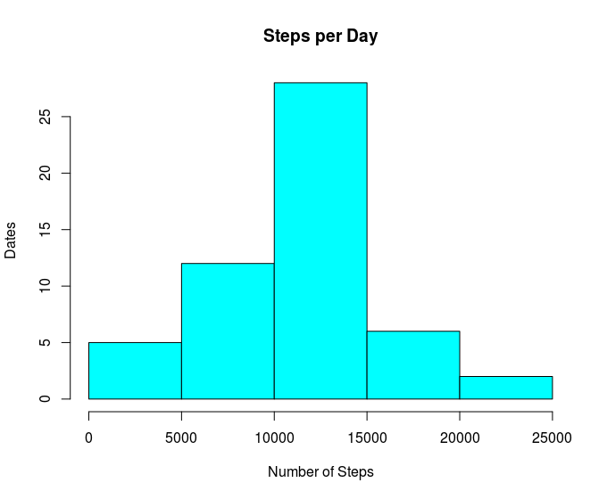
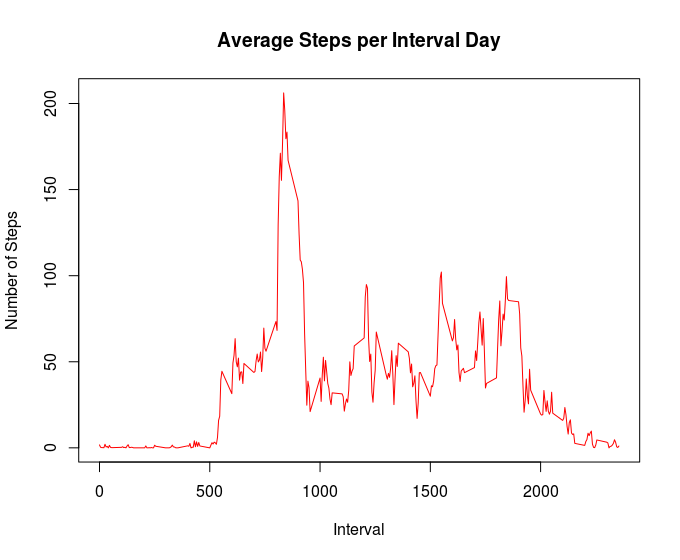
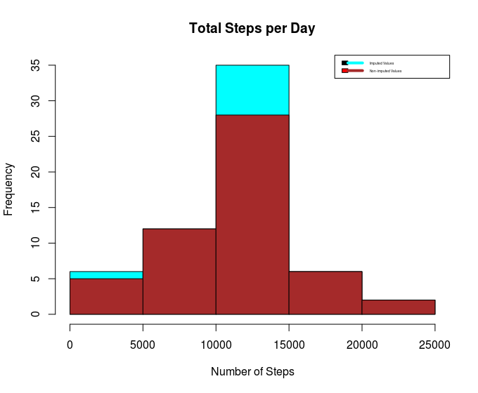
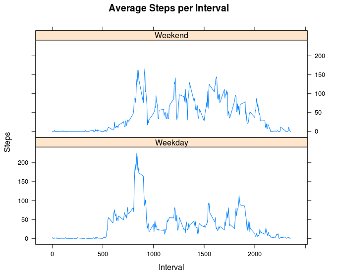

# Project Overview

In this project of Reproducible Research course we will be answering questions using data collected under Activity.zip file attached in the project directory to analyze from a FitBit.
The purpose of this project is to practice on:

* loading and preprocessing data
* imputing missing values
* interpreting data to answer research questions

The data for this assignment was downloaded from the course web
site:
* Dataset: [Activity monitoring data](https://d396qusza40orc.cloudfront.net/repdata%2Fdata%2Factivity.zip) [52K]
The variables included in this dataset are:
* **steps**: Number of steps taking in a 5-minute interval (missing
    values are coded as `NA`)
* **date**: The date on which the measurement was taken in YYYY-MM-DD
    format
* **interval**: Identifier for the 5-minute interval in which
    measurement was taken
The dataset is stored in a comma-separated-value (CSV) file and there are a total of 17,568 observations in this dataset.

## Loading and preprocessing the data
If dataset doesn't exsit ,download,unzip and load data into R data frame `Activity`. 
```r
if(!file.exists("getdata-projectfiles-UCI HAR Dataset.zip")) {
        temp <- tempfile()
        download.file("http://d396qusza40orc.cloudfront.net/repdata%2Fdata%2Factivity.zip",temp)
        unzip(temp)
        unlink(temp)
}
Activity <- read.csv("activity.csv")
```
## What is mean total number of steps taken per day?
Aggregate steps per day, plot it using Histogram, then calculate the mean and median for the total.
```r
stepsPerDay <- aggregate(steps ~ date, Activity, sum)
hist(stepsPerDay$steps, main = paste("Steps per Day"), col="cyan", xlab="Number of Steps",ylab="Dates")
```
 
```r
activityMean <- mean(stepsPerDay$steps)
activityMedian <- median(stepsPerDay$steps)
```
#### The `mean` is 10,766 and the `median` is 10,765.

## What is the average daily activity pattern?

* Calculate average steps for each interval. 
* Plot the Average Number Steps per Interval Day. 
* Retrieve the interval with the highest average steps. 
```r
stepsPerInterval <- aggregate(steps ~ interval, Activity, mean)
plot(stepsPerInterval$interval,stepsPerInterval$steps, type="l", xlab="Interval", ylab="Number of Steps",main="Average Steps per Interval Day", col="red")
```
 
```r
maximumInterval <- stepsPerInterval[which.max(stepsPerInterval$steps),1]
```
#### The 5-minute interval containing the maximum number of steps is 835.

## Impute missing values. Compare imputed to non-imputed data.

Missing data May affect our analysis and for that it needs to be imputed. 
Missing values were imputed by inserting the mean for each interval. i.e.: if interval 25 was missing on 2012-10-01, the average for that interval will replace the NA value.

```r
missingValues <- sum(!complete.cases(Activity))
imputed_Values <- transform(Activity, steps = ifelse(is.na(Activity$steps), stepsPerInterval$steps[match(Activity$interval, stepsPerInterval$interval)], Activity$steps))
```

Zeroes were imputed for Days with Zero Intervals. For example: The first day "2012-10-01" would have been over than 8000 steps higher than day after, which had only 126 steps. NAs then were replaced by zeros to fit the rising trend of the data. 
```r
imputed_Values[as.character(imputed_Values$date) == "2012-10-01", 1] <- 0
```

Recalculate total steps by day and plot the results. 
```r
stepsPerIntervalDay <- aggregate(steps ~ date, imputed_Values, sum)
hist(stepsPerIntervalDay$steps, main = paste("Total Steps per Day"), col="cyan", xlab="Number of Steps")
#Create Histogram to show difference. 
hist(stepsPerDay$steps, main = paste("Total Steps Each Day"), col="brown", xlab="Number of Steps", add=T)
legend("topright", c("Imputed Values", "Non-imputed Values"), col=c("cyan", "brown"), lwd=4,fill = 1:6, ncol = 1,cex = 0.3)
```


Calculate new mean and median for imputed data. 
```r
intervalMean <- mean(stepsPerIntervalDay$steps)
intervalMedian <- median(stepsPerIntervalDay$steps)
```
Calculate difference between imputed and non-imputed data.
```r
meanDifference <- intervalMean - activityMean
medDifference <- intervalMedian - activityMedian
```
Calculate total difference.
```r
total_Difference <- sum(stepsPerIntervalDay$steps) - sum(stepsPerDay$steps)
```
* The mean of imputed values is 10,599
* The median of imputed values is 10,766
* The difference between the two means is -176.4949
* The difference between medians is 1.1887
* The difference between total number of steps between imputed and non-imputed values is 75363. In other words, a total of 75363 more steps in the imputed values.

## Are there differences in activity patterns between weekdays and weekends?
A plot to compare the difference between number of steps in a given week and weekend.
```r
weekdays <- c("Monday", "Tuesday", "Wednesday", "Thursday", 
              "Friday")
imputed_Values$dow = as.factor(ifelse(is.element(weekdays(as.Date(imputed_Values$date)),weekdays), "Weekday", "Weekend"))
stepsPerIntervalDay <- aggregate(steps ~ interval + dow, imputed_Values, mean)
xyplot(stepsPerIntervalDay$steps ~ stepsPerIntervalDay$interval|stepsPerIntervalDay$dow, main="Average Steps per Interval",xlab="Interval", ylab="Steps",layout=c(1,2), type="l")
```
 
